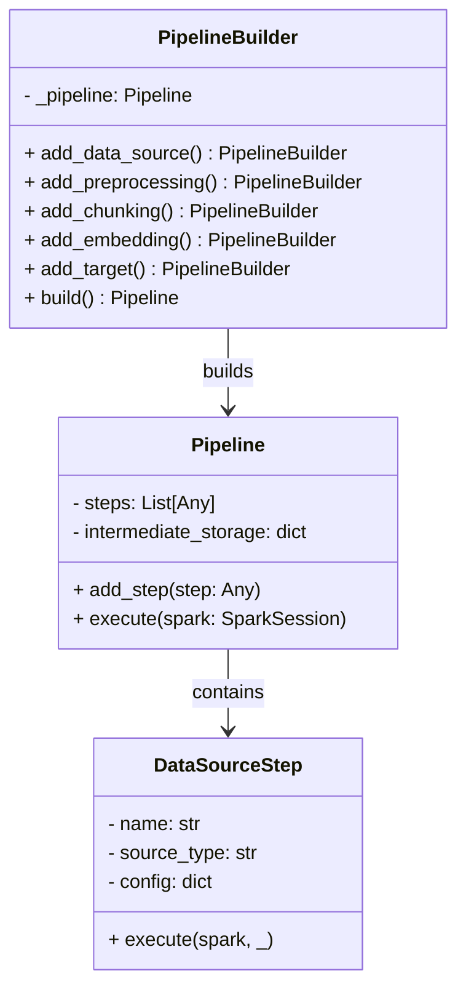

### 1. Builder Pattern Implementation Code (Python)
```python
from pyspark.sql import SparkSession
from typing import List, Any

class Pipeline:
    """Complex object being constructed"""
    def __init__(self):
        self.steps: List[Any] = []
        self.intermediate_storage = {}

    def add_step(self, step: Any):
        self.steps.append(step)
    
    def execute(self, spark: SparkSession):
        """Execute pipeline steps in sequence"""
        intermediate_data = None
        for step in self.steps:
            intermediate_data = step.execute(spark, intermediate_data)
            self.intermediate_storage[step.name] = intermediate_data
            intermediate_data.cache().count()  # Force persistence
        return intermediate_data

class PipelineBuilder:
    """Builder for constructing pipeline instances"""
    def __init__(self):
        self._pipeline = Pipeline()
    
    def add_data_source(self, source_type: str, config: dict):
        self._pipeline.add_step(DataSourceStep(source_type, config))
        return self
    
    def add_preprocessing(self, strategies: List[str]):
        self._pipeline.add_step(PreprocessingStep(strategies))
        return self
    
    def add_chunking(self, strategy: str, params: dict):
        self._pipeline.add_step(ChunkingStep(strategy, params))
        return self
    
    def add_embedding(self, method: str, model_config: dict):
        self._pipeline.add_step(EmbeddingStep(method, model_config))
        return self
    
    def add_target(self, target_type: str, config: dict):
        self._pipeline.add_step(TargetStep(target_type, config))
        return self
    
    def build(self) -> Pipeline:
        """Finalize pipeline construction"""
        return self._pipeline

class DataSourceStep:
    """Concrete pipeline step implementation"""
    def __init__(self, source_type: str, config: dict):
        self.name = f"data_source_{source_type}"
        self.source_type = source_type
        self.config = config
    
    def execute(self, spark: SparkSession, _):
        return DataSourceFactory.create_source(self.source_type).read(spark, self.config)

# Usage example
if __name__ == "__main__":
    spark = SparkSession.builder.getOrCreate()
    
    pipeline = (PipelineBuilder()
                .add_data_source("hive", {"table": "raw_documents"})
                .add_preprocessing(["html_clean", "normalize"])
                .add_chunking("fixed_size", {"size": 512})
                .add_embedding("sentence", {"model": "all-MiniLM-L6-v2"})
                .add_target("vectordb", {"endpoint": "chroma://prod"})
                .build())
    
    result = pipeline.execute(spark)
```

### 2. Mermaid Process Diagram (Markdown)
````markdown

````

### 3. Detailed Explanation

**1. Pattern Components:**
- **Builder Interface:** `PipelineBuilder` with fluent methods
- **Concrete Builder:** Same class implements all construction steps
- **Product:** `Pipeline` with execution logic
- **Director:** Client code orchestrates construction

**2. Class Diagram Explanation:**
- Builder maintains and assembles pipeline components
- Product contains complex execution logic
- Steps are added through fluent interface
- Final product created via build() method

**3. Key Features:**
- **Step-by-Step Construction:** Complex object assembled incrementally
- **Fluent Interface:** Method chaining for readability
- **Multiple Representations:** Different pipeline configurations
- **Encapsulation:** Construction logic separated from business logic
- **Immutable Product:** Pipeline finalized after build()

**4. NLP Pipeline Application:**
```python
# Different pipeline configurations
text_processing = (PipelineBuilder()
    .add_data_source("file", {"format": "text", "path": "/data"})
    .add_preprocessing(["normalize"])
    .build())

full_etl = (PipelineBuilder()
    .add_data_source("hive", {"table": "docs"})
    .add_preprocessing(["html_clean", "stem"])
    .add_chunking("semantic", {"model": "bert"})
    .add_embedding("tfidf", {"features": 1000})
    .add_target("rdbms", {"table": "vectors"})
    .build())
```

**5. Benefits in ETL Pipeline:**
1. **Complex Pipeline Management:** Handle multi-step workflows
2. **Configuration Variants:** Create different pipeline types
3. **Optional Components:** Skip unnecessary steps
4. **Construction Validation:** Validate at build time
5. **Reusable Components:** Share common step configurations

**6. Implementation Considerations:**
- **Step Ordering:** Validate step sequence during building
- **Intermediate Storage:** Manage Spark persistence strategies
- **Error Handling:** Implement rollback/checkpoint mechanisms
- **Parallel Execution:** Support for branching pipelines
- **Configuration Validation:** Check parameters at build time

**7. Pipeline Construction Process:**
```
Construction Flow:
1. Initialize empty Pipeline object
2. Add required processing steps
3. Validate step dependencies
4. Freeze configuration on build()
5. Execute steps in sequence
6. Persist intermediate results

Step Types:
- Data Ingestion: Sources and connectors
- Transformation: Cleaning/processing
- Vectorization: Embedding generation
- Storage: Output destinations
```

**8. Pattern Integration:**
```
Component Relationships:
- Factory Pattern → Creates step components
- Strategy Pattern ← Used within processing steps
- Template Method → Defines step execution flow
- Singleton → Shares configuration across steps
- Observer Pattern → Monitoring pipeline execution

Execution Sequence:
Builder → (uses) → Factories → (creates) → Strategies → (processed by) → Template Methods
```

**9. Performance Optimization:**
- **Lazy Execution:** Leverage Spark's lazy evaluation
- **Cache Management:** Smart persistence of intermediates
- **Cluster Tuning:** Resource allocation per step type
- **Batch Processing:** Optimal chunk sizes for embeddings
- **Parallel Reads:** Concurrent data source access

This implementation provides a robust framework for constructing complex NLP pipelines while maintaining flexibility and scalability. The Builder Pattern enables the creation of different pipeline configurations through a clear, readable interface while ensuring proper execution sequencing and resource management.