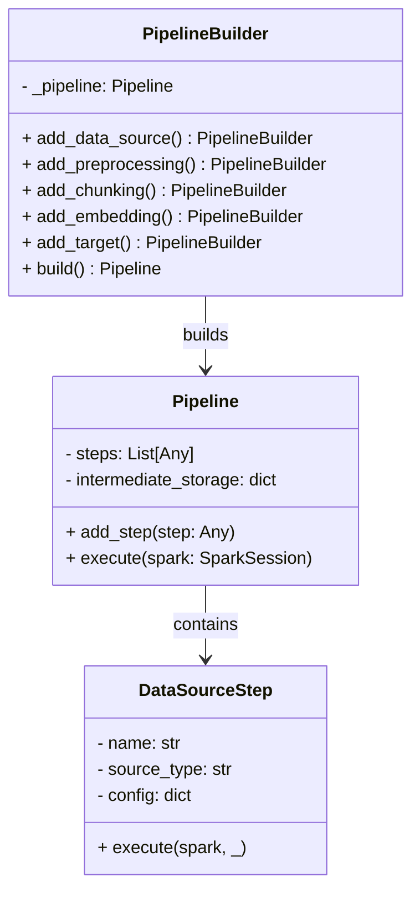

```mermaid
classDiagram
    class PipelineBuilder {
        - _pipeline: Pipeline
        + add_data_source() PipelineBuilder
        + add_preprocessing() PipelineBuilder
        + add_chunking() PipelineBuilder
        + add_embedding() PipelineBuilder
        + add_target() PipelineBuilder
        + build() Pipeline
    }
    
    class Pipeline {
        - steps: List[Any]
        - intermediate_storage: dict
        + add_step(step: Any)
        + execute(spark: SparkSession)
    }
    
    class DataSourceStep {
        - name: str
        - source_type: str
        - config: dict
        + execute(spark, _)
    }
    
    PipelineBuilder --> Pipeline : builds
    Pipeline --> DataSourceStep : contains
```