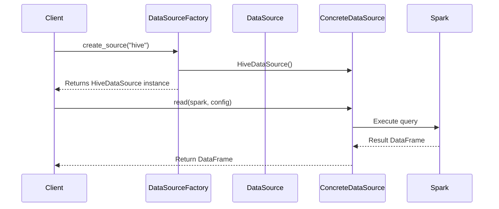

### 1. Factory Pattern Implementation Code (Python)
```python
from abc import ABC, abstractmethod
from pyspark.sql import DataFrame, SparkSession

class DataSource(ABC):
    """Abstract base class for data sources"""
    @abstractmethod
    def read(self, spark: SparkSession, config: dict) -> DataFrame:
        pass

class HiveDataSource(DataSource):
    """Concrete implementation for Hive data source"""
    def read(self, spark: SparkSession, config: dict) -> DataFrame:
        return spark.sql(f"SELECT * FROM {config['table_name']}")

class FileDataSource(DataSource):
    """Concrete implementation for file data source"""
    def read(self, spark: SparkSession, config: dict) -> DataFrame:
        return spark.read.format(config['format']).load(config['path'])

class RDBCDataSource(DataSource):
    """Concrete implementation for relational database source"""
    def read(self, spark: SparkSession, config: dict) -> DataFrame:
        return spark.read \
            .format("jdbc") \
            .option("url", config['url']) \
            .option("dbtable", config['table']) \
            .load()

class DataSourceFactory:
    """Factory class for creating data source instances"""
    @staticmethod
    def create_source(source_type: str) -> DataSource:
        if source_type == "hive":
            return HiveDataSource()
        elif source_type == "file":
            return FileDataSource()
        elif source_type == "rdbms":
            return RDBCDataSource()
        elif source_type == "mongodb":
            return MongoDBDataSource()
        elif source_type == "vectordb":
            return VectorDBDataSource()
        else:
            raise ValueError(f"Unsupported data source type: {source_type}")

# Usage example
if __name__ == "__main__":
    factory = DataSourceFactory()
    spark = SparkSession.builder.getOrCreate()
    
    # Get Hive source
    hive_source = factory.create_source("hive")
    df = hive_source.read(spark, {"table_name": "customer_data"})
    
    # Get File source
    file_source = factory.create_source("file")
    df = file_source.read(spark, {"format": "parquet", "path": "/data/files"})
```

### 2. Mermaid Process Diagram (Markdown)
````markdown

````

### 3. Detailed Explanation

**1. Pattern Components:**
- **Abstract Product:** `DataSource` interface
- **Concrete Products:** `HiveDataSource`, `FileDataSource`, `RDBCDataSource`
- **Factory:** `DataSourceFactory` with creation method
- **Client:** Pipeline components requesting data sources

**2. Sequence Diagram Explanation:**
1. Client requests data source from factory
2. Factory creates appropriate concrete implementation
3. Client uses standardized interface to read data
4. Concrete implementation handles source-specific operations
5. DataFrame returned to client

**3. Key Features:**
- **Encapsulation:** Creation logic hidden from clients
- **Extensibility:** Easy to add new data sources
- **Polymorphism:** Uniform interface for all sources
- **Centralized Control:** Single point for object creation

**4. NLP Pipeline Application:**
```python
# In pipeline configuration
config = {
    "sources": {
        "documents": {"type": "file", "format": "text", "path": "/data/docs"},
        "user_data": {"type": "hive", "table": "user_profiles"}
    }
}

# Pipeline execution
for source_name, source_config in config["sources"].items():
    source = DataSourceFactory.create_source(source_config["type"])
    df = source.read(spark, source_config)
    # Process dataframe...
```

**5. Benefits in ETL Pipeline:**
1. **Modular Architecture:** Isolate source-specific code
2. **Runtime Flexibility:** Switch sources without code changes
3. **Standardized Interface:** Uniform read() method for all sources
4. **Scalability:** Easy to support new data sources
5. **Testability:** Mock sources for unit testing

**6. Implementation Considerations:**
- **Dynamic Loading:** Use reflection for automatic source registration
- **Validation:** Add input validation in factory method
- **Caching:** Implement instance caching for expensive connections
- **Error Handling:** Standardize error reporting across sources

**7. Pattern Integration:**
```
Component Relationships:
- Singleton (Config Manager) ↔ Factory (DataSource)
- Factory → Strategy (Reading implementations)
- Builder (Pipeline) ← Factory (Data sources)

Execution Flow:
1. Pipeline Builder requests configuration
2. Factory creates source using config
3. Source uses Strategy pattern for specific read implementations
4. Data flows through standardized interface
```

**8. Supported Data Sources Table:**

| Source Type    | Class               | Configuration Parameters             |
|----------------|---------------------|--------------------------------------|
| Hive           | HiveDataSource      | table_name, filter_condition         |
| File           | FileDataSource      | format, path, schema                 |
| RDBMS          | RDBCDataSource      | url, driver, table, user, password   |
| MongoDB        | MongoDBDataSource   | uri, database, collection            |
| VectorDB       | VectorDBDataSource  | endpoint, index_name, api_key        |

This implementation provides a flexible foundation for handling multiple data source types in the NLP pipeline while maintaining clean separation of concerns and enabling easy expansion to new data source types.

