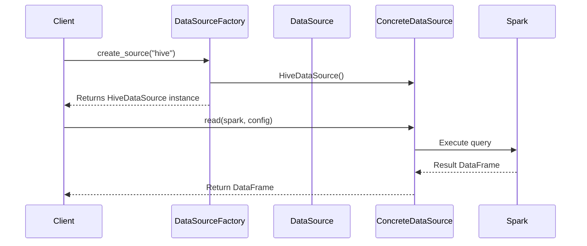

```mermaid
sequenceDiagram
    participant Client
    participant DataSourceFactory
    participant DataSource
    participant ConcreteDataSource

    Client->>DataSourceFactory: create_source("hive")
    DataSourceFactory->>ConcreteDataSource: HiveDataSource()
    DataSourceFactory-->>Client: Returns HiveDataSource instance
    
    Client->>ConcreteDataSource: read(spark, config)
    ConcreteDataSource->>Spark: Execute query
    Spark-->>ConcreteDataSource: Result DataFrame
    ConcreteDataSource-->>Client: Return DataFrame
```