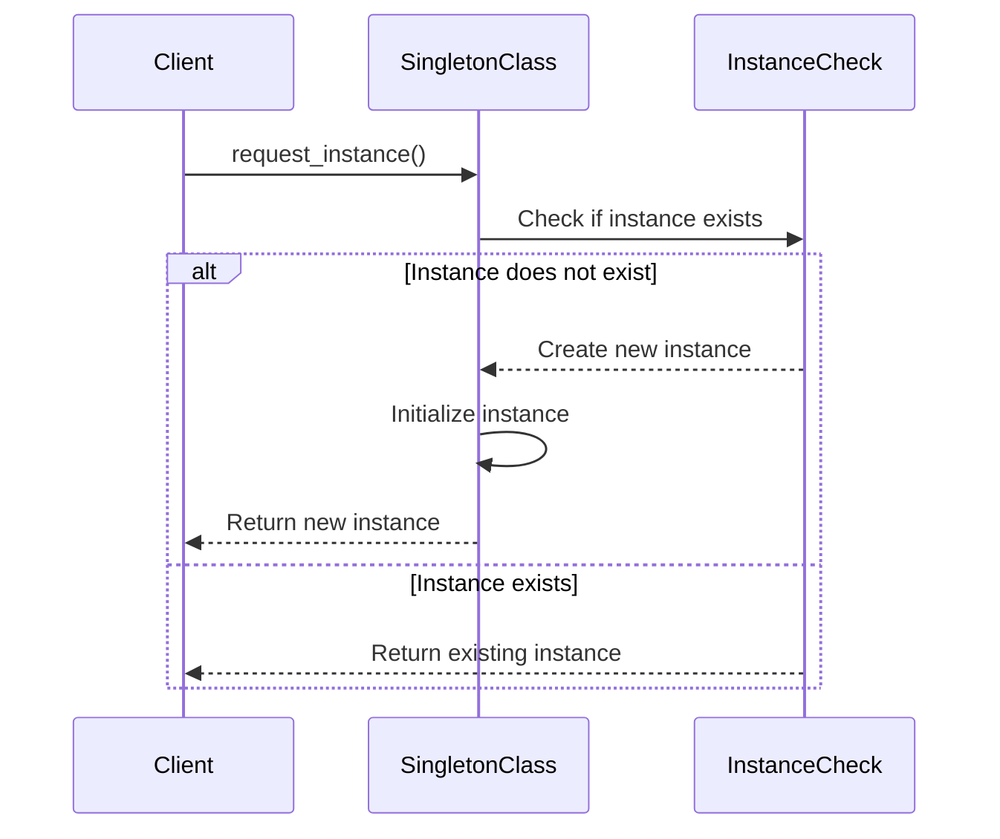

Here's the implementation of the Singleton design pattern with a detailed explanation and Mermaid diagram:

### 1. Singleton Pattern Implementation Code (Python)
```python
class ConfigurationManager:
    """
    Singleton class for managing configurations across the NLP ETL pipeline
    Implements lazy initialization and thread-safe pattern
    """
    _instance = None

    def __new__(cls):
        if cls._instance is None:
            cls._instance = super().__new__(cls)
            # Initialize default configurations
            cls._instance.configurations = {}
            cls._instance.initialized = False
        return cls._instance

    def initialize(self, config_path: str = None):
        """Initialize configurations from file"""
        if not self.initialized:
            if config_path:
                # Load configurations from file
                self._load_configurations(config_path)
            self.initialized = True

    def _load_configurations(self, config_path: str):
        """Private method to load configurations"""
        # Implementation for loading from JSON/YAML
        pass

    def get_config(self, key: str):
        """Get configuration value"""
        return self.configurations.get(key)

    def add_config(self, key: str, value: Any):
        """Add/Update configuration"""
        self.configurations[key] = value

# Usage example
if __name__ == "__main__":
    config1 = ConfigurationManager()
    config1.initialize("config/pipeline_config.yaml")
    
    config2 = ConfigurationManager()
    print(config1 is config2)  # Output: True
```

### 2. Mermaid Process Diagram (Markdown)
````markdown

````

### 3. Detailed Explanation

**1. Pattern Components:**
- **Singleton Class:** `ConfigurationManager`
- **Private Class Variable:** `_instance` stores the single instance
- **Initialization Control:** `__new__` method controls instantiation
- **Lazy Initialization:** Instance created only when first requested

**2. Sequence Diagram Explanation:**
1. Client requests Singleton instance
2. Class checks if instance already exists
3. If no instance exists:
   - Creates new instance
   - Performs initialization
   - Returns new instance
4. If instance exists:
   - Immediately returns existing instance

**3. Key Features:**
- **Thread-Safe Initialization:** Safe for multi-threaded environments
- **Global Access Point:** `ConfigurationManager()` always returns same instance
- **Lazy Loading:** Configurations loaded only when first needed
- **Centralized Management:** Single point for configuration updates

**4. NLP Pipeline Application:**
```python
# In pipeline components
config = ConfigurationManager()

# Data Source Component
db_config = config.get_config("database")
# Preprocessing Component
clean_params = config.get_config("cleaning_params")
# Chunking Component
chunk_rules = config.get_config("chunking_rules")
```

**5. Benefits in ETL Pipeline:**
1. **Consistent Configurations:** All modules use same config state
2. **Resource Efficiency:** Avoids multiple config file reads
3. **Traceability:** Single source of truth for parameters
4. **Runtime Updates:** Centralized configuration changes

**6. Implementation Considerations:**
- **Thread Safety:** Add locking mechanism for concurrent access
- **Serialization:** Handle carefully in distributed systems
- **Testability:** Use reset mechanism for unit tests
- **Inheritance:** Prevent subclassing breaking singleton pattern

**7. Pipeline Integration:**
```
Project Structure Integration:
config/
├── base_config.py (Singleton implementation)
├── data_source_configs/
├── preprocessing_configs/
└── target_configs/

Execution Flow:
1. Pipeline initialization
2. ConfigurationManager loads all configs
3. Factory patterns use configs via Singleton
4. All components access configs through Singleton
```

This implementation ensures that configuration management remains centralized and efficient while providing thread-safe access to pipeline parameters. The Singleton pattern is particularly valuable in ETL pipelines where consistent configuration access across multiple processing stages is critical.