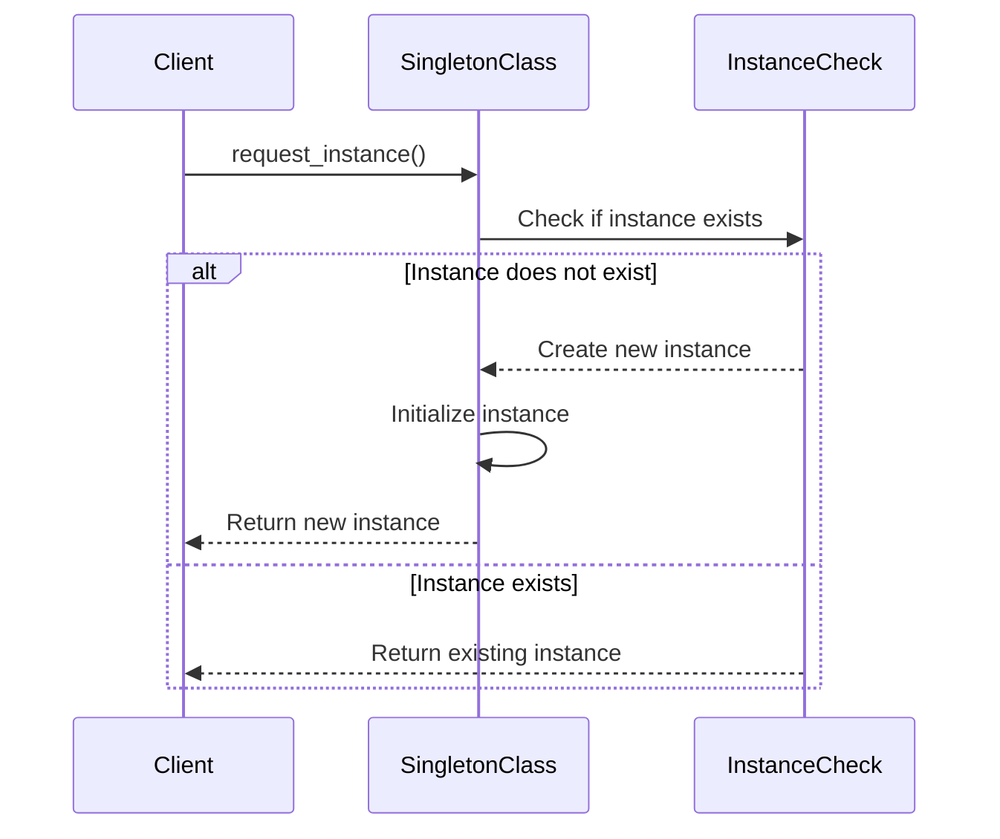

```mermaid
sequenceDiagram
    participant Client
    participant SingletonClass
    participant InstanceCheck
    
    Client->>SingletonClass: request_instance()
    SingletonClass->>InstanceCheck: Check if instance exists
    alt Instance does not exist
        InstanceCheck-->>SingletonClass: Create new instance
        SingletonClass->>SingletonClass: Initialize instance
        SingletonClass-->>Client: Return new instance
    else Instance exists
        InstanceCheck-->>Client: Return existing instance
    end
```