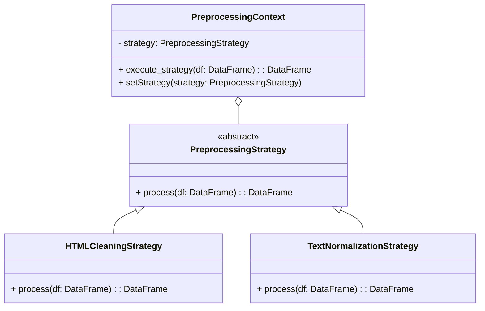

### 1. Strategy Pattern Implementation Code (Python)
```python
from abc import ABC, abstractmethod
from pyspark.sql import DataFrame, functions as F
from pyspark.sql.types import StringType
from bs4 import BeautifulSoup

class PreprocessingStrategy(ABC):
    """Abstract base class defining preprocessing strategy interface"""
    @abstractmethod
    def process(self, df: DataFrame, column: str) -> DataFrame:
        pass

class HTMLCleaningStrategy(PreprocessingStrategy):
    """Concrete strategy for HTML content cleaning"""
    def process(self, df: DataFrame, column: str) -> DataFrame:
        def clean_html(html: str) -> str:
            return BeautifulSoup(html, 'html.parser').get_text() if html else ""
        
        clean_udf = F.udf(clean_html, StringType())
        return df.withColumn(column, clean_udf(F.col(column)))

class TextNormalizationStrategy(PreprocessingStrategy):
    """Concrete strategy for text normalization"""
    def process(self, df: DataFrame, column: str) -> DataFrame:
        return df.withColumn(column, 
            F.lower(F.trim(F.regexp_replace(F.col(column), "[^a-zA-Z0-9\\s]", "")))
        )

class PreprocessingContext:
    """Context class that maintains a reference to a strategy"""
    def __init__(self, strategy: PreprocessingStrategy):
        self._strategy = strategy

    @property
    def strategy(self) -> PreprocessingStrategy:
        return self._strategy

    @strategy.setter
    def strategy(self, strategy: PreprocessingStrategy) -> None:
        self._strategy = strategy

    def execute_strategy(self, df: DataFrame, column: str = "content") -> DataFrame:
        return self._strategy.process(df, column)

# Usage example
if __name__ == "__main__":
    spark = SparkSession.builder.getOrCreate()
    data = [("<html><body>Sample <b>text</b></body></html>",)]
    df = spark.createDataFrame(data, ["raw_content"])

    # Create context with HTML cleaning strategy
    context = PreprocessingContext(HTMLCleaningStrategy())
    cleaned_df = context.execute_strategy(df, "raw_content")

    # Switch to normalization strategy
    context.strategy = TextNormalizationStrategy()
    normalized_df = context.execute_strategy(cleaned_df, "raw_content")
```

### 2. Mermaid Process Diagram (Markdown)
````markdown

````

### 3. Detailed Explanation

**1. Pattern Components:**
- **Strategy Interface:** `PreprocessingStrategy` abstract base class
- **Concrete Strategies:** `HTMLCleaningStrategy`, `TextNormalizationStrategy`
- **Context:** `PreprocessingContext` that executes the strategy
- **Client:** Pipeline components that utilize preprocessing

**2. Class Diagram Explanation:**
- Context maintains reference to Strategy object
- Strategy interface declares common process() method
- Concrete strategies implement algorithm variants
- Context delegates execution to current strategy

**3. Key Features:**
- **Algorithm Interchangeability:** Strategies can be swapped at runtime
- **Separation of Concerns:** Business logic separated from algorithms
- **Open/Closed Principle:** New strategies added without modifying context
- **Testability:** Each strategy can be tested independently

**4. NLP Pipeline Application:**
```python
# In pipeline configuration
preprocessing_steps = [
    {"type": "html_clean", "column": "raw_content"},
    {"type": "normalize", "column": "clean_content"}
]

# Pipeline execution
context = PreprocessingContext(None)
for step in preprocessing_steps:
    strategy = StrategyFactory.create_strategy(step["type"])
    context.strategy = strategy
    df = context.execute_strategy(df, step["column"])
```

**5. Benefits in ETL Pipeline:**
1. **Modular Preprocessing:** Each cleaning step as separate strategy
2. **Runtime Flexibility:** Change processing order/algorithms dynamically
3. **Code Reusability:** Share strategies across different pipelines
4. **Complexity Management:** Isolate complex cleaning logic
5. **Parameterization:** Configure strategies through JSON/YAML

**6. Implementation Considerations:**
- **Strategy Registration:** Use factory pattern for strategy creation
- **State Management:** Make strategies stateless where possible
- **Performance:** Cache UDFs and reuse strategies where appropriate
- **Composition:** Allow chaining of strategies for complex workflows

**7. Common Strategy Types in NLP Pipeline:**

| Strategy Type          | Description                          | Example Use Cases                 |
|------------------------|--------------------------------------|-----------------------------------|
| HTML Cleaning          | Remove HTML tags                     | Web scraped content               |
| Text Normalization     | Lowercase, remove special characters | Text standardization              |
| Entity Recognition     | Identify and tag entities            | PII redaction                     |
| Language Detection     | Identify text language               | Multi-lingual content processing  |
| Stemming/Lemmatization | Reduce words to base form            | Text normalization                |

**8. Pattern Integration:**
```
Component Relationships:
- Factory Pattern → Creates strategies
- Builder Pattern → Configures strategy sequence
- Template Method → Defines strategy skeleton
- Singleton → Shares strategy configurations

Execution Flow:
1. Pipeline Builder configures strategies
2. Strategy Factory creates instances
3. Context executes current strategy
4. Strategies transform data incrementally
5. Processed data passed to next stage
```

This implementation enables flexible processing workflows in the NLP pipeline while maintaining clean separation between different preprocessing techniques. The Strategy pattern is particularly valuable in ETL systems where data transformation requirements frequently evolve and multiple processing approaches need to be supported simultaneously.