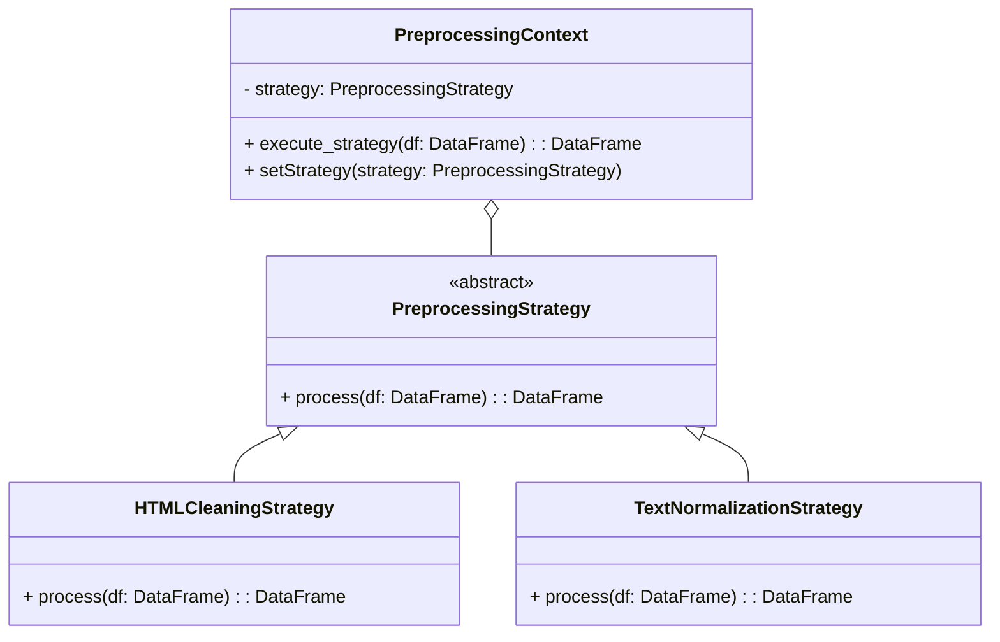

```mermaid
classDiagram
    class PreprocessingContext {
        - strategy: PreprocessingStrategy
        + execute_strategy(df: DataFrame): DataFrame
        + setStrategy(strategy: PreprocessingStrategy)
    }

    class PreprocessingStrategy {
        <<abstract>>
        + process(df: DataFrame): DataFrame
    }

    class HTMLCleaningStrategy {
        + process(df: DataFrame): DataFrame
    }

    class TextNormalizationStrategy {
        + process(df: DataFrame): DataFrame
    }

    PreprocessingContext o-- PreprocessingStrategy
    PreprocessingStrategy <|-- HTMLCleaningStrategy
    PreprocessingStrategy <|-- TextNormalizationStrategy
```