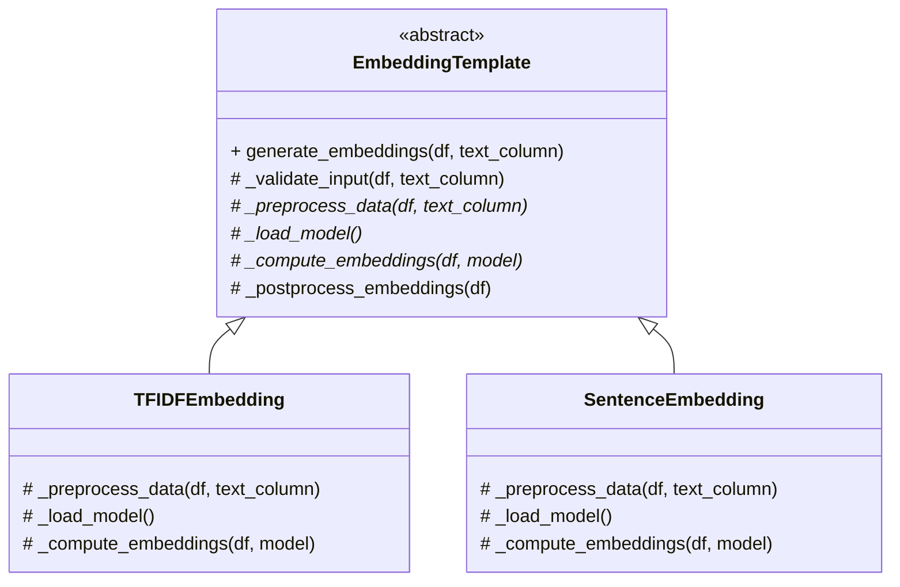

### 1. Template Method Pattern Implementation Code (Python)
```python
from abc import ABC, abstractmethod
from pyspark.sql import DataFrame
from pyspark.ml.feature import HashingTF, IDF
from sentence_transformers import SentenceTransformer

class EmbeddingTemplate(ABC):
    """Abstract class defining embedding generation template"""
    
    def generate_embeddings(self, df: DataFrame, text_column: str) -> DataFrame:
        """Template method defining the embedding generation process"""
        self._validate_input(df, text_column)
        preprocessed_df = self._preprocess_data(df, text_column)
        model = self._load_model()
        embeddings_df = self._compute_embeddings(preprocessed_df, model)
        return self._postprocess_embeddings(embeddings_df)

    def _validate_input(self, df: DataFrame, text_column: str):
        """Common validation steps"""
        if text_column not in df.columns:
            raise ValueError(f"Text column {text_column} not found in DataFrame")
            
    @abstractmethod
    def _preprocess_data(self, df: DataFrame, text_column: str) -> DataFrame:
        """Data preprocessing hook (must be implemented)"""
        pass

    @abstractmethod
    def _load_model(self):
        """Model loading hook (must be implemented)"""
        pass

    @abstractmethod
    def _compute_embeddings(self, df: DataFrame, model) -> DataFrame:
        """Embedding computation hook (must be implemented)"""
        pass

    def _postprocess_embeddings(self, df: DataFrame) -> DataFrame:
        """Optional postprocessing step (can be overridden)"""
        return df

class TFIDFEmbedding(EmbeddingTemplate):
    """Concrete implementation for TF-IDF embeddings"""
    
    def _preprocess_data(self, df: DataFrame, text_column: str) -> DataFrame:
        """Clean and tokenize text data"""
        return df.withColumn("tokens", F.split(F.lower(F.col(text_column)), " "))

    def _load_model(self):
        """Initialize TF-IDF components"""
        return {
            'hashing_tf': HashingTF(inputCol="tokens", outputCol="raw_features"),
            'idf': IDF(inputCol="raw_features", outputCol="features")
        }

    def _compute_embeddings(self, df: DataFrame, model) -> DataFrame:
        """Apply TF-IDF transformation"""
        tf_df = model['hashing_tf'].transform(df)
        return model['idf'].fit(tf_df).transform(tf_df)

class SentenceEmbedding(EmbeddingTemplate):
    """Concrete implementation for sentence embeddings"""
    
    def _preprocess_data(self, df: DataFrame, text_column: str) -> DataFrame:
        """Basic text cleaning"""
        return df.withColumn("clean_text", F.trim(F.col(text_column)))

    def _load_model(self):
        """Load pretrained sentence transformer"""
        return SentenceTransformer('all-MiniLM-L6-v2')

    def _compute_embeddings(self, df: DataFrame, model) -> DataFrame:
        """Generate sentence embeddings"""
        def generate_embeddings(text):
            return model.encode(text).tolist()
            
        embedding_udf = F.udf(generate_embeddings, ArrayType(FloatType()))
        return df.withColumn("embeddings", embedding_udf("clean_text"))

# Usage example
if __name__ == "__main__":
    spark = SparkSession.builder.getOrCreate()
    data = [("Text to embed",), ("Another document",)]
    df = spark.createDataFrame(data, ["text"])
    
    # TF-IDF embedding
    tfidf_processor = TFIDFEmbedding()
    tfidf_df = tfidf_processor.generate_embeddings(df, "text")
    
    # Sentence embedding
    sentence_processor = SentenceEmbedding()
    sentence_df = sentence_processor.generate_embeddings(df, "text")
```

### 2. Mermaid Process Diagram (Markdown)
````markdown

````

### 3. Detailed Explanation

**1. Pattern Components:**
- **Abstract Class:** `EmbeddingTemplate` defines template method and hooks
- **Template Method:** `generate_embeddings()` controls the algorithm flow
- **Concrete Classes:** `TFIDFEmbedding` and `SentenceEmbedding` implement hooks
- **Hooks:** Abstract methods (`_preprocess_data`, `_load_model`, `_compute_embeddings`)
- **Optional Hook:** `_postprocess_embeddings` with default implementation

**2. Class Diagram Explanation:**
- Abstract class declares template method and abstract hooks
- Concrete classes implement required operations
- Inheritance hierarchy maintains algorithm structure
- Optional postprocessing step shows flexible hook implementation

**3. Key Features:**
- **Algorithm Structure:** Fixed process flow with customizable steps
- **Code Reuse:** Common validation in base class
- **Extension Points:** Subclasses implement domain-specific operations
- **Inversion of Control:** Base class controls process flow
- **Consistent Interface:** Uniform embedding generation across implementations

**4. NLP Pipeline Application:**
```python
# In pipeline configuration
embedding_config = {
    "type": "sentence",
    "text_column": "clean_content",
    "model_name": "all-MiniLM-L6-v2"
}

# Pipeline execution
class CustomSentenceEmbedding(SentenceEmbedding):
    def _postprocess_embeddings(self, df):
        return df.withColumn("normalized", F.l2_normalize("embeddings"))

processor = EmbeddingFactory.create(embedding_config["type"])
embeddings_df = processor.generate_embeddings(clean_df, embedding_config["text_column"])
```

**5. Benefits in ETL Pipeline:**
1. **Process Standardization:** Enforces consistent embedding generation flow
2. **Variant Management:** Easy to support new embedding types
3. **Quality Control:** Centralized input validation
4. **Maintainability:** Isolate algorithm changes to specific hooks
5. **Documentation:** Clear structure through template method

**6. Implementation Considerations:**
- **Hook Granularity:** Balance between flexibility and complexity
- **Parameter Passing:** Use context objects for complex parameter sharing
- **Lifecycle Management:** Handle model loading/caching efficiently
- **Error Handling:** Implement consistent error reporting across hooks
- **Performance Optimization:** Leverage Spark's distributed processing

**7. Template Method Variations:**

| Hook Type         | Description                          | Example Usage                  |
|-------------------|--------------------------------------|--------------------------------|
| Abstract Method   | Must be implemented by subclasses    | Core embedding computation     |
| Concrete Method   | Fixed implementation in base class   | Input validation               |
| Hook Method       | Optional override in subclasses      | Postprocessing transformations |
| Null Object       | Default empty implementation         | Optional processing steps      |

**8. Pattern Integration:**
```
Component Relationships:
- Factory Pattern → Creates concrete template instances
- Strategy Pattern ↔ Template Method (Strategy for steps vs Template for flow)
- Builder Pattern ← Template Method (Build complex templates)
- Singleton → Share template configurations

Execution Flow:
1. Factory creates appropriate template instance
2. Template method orchestrates processing steps
3. Subclass hooks implement specific operations
4. Optional steps provide customization points
5. Final embeddings passed to next pipeline stage
```

**9. Performance Optimization Techniques:**
- **Model Caching:** Reuse loaded models across batches
- **Batch Processing:** Optimize for Spark's distributed processing
- **Vectorization:** Use native Spark MLlib operations where possible
- **Broadcast Variables:** Share large models efficiently across nodes
- **Checkpointing:** Persist intermediate results for fault tolerance

This implementation provides a robust foundation for managing different embedding generation approaches in the NLP pipeline while ensuring consistent quality and maintainability. The Template Method Pattern is particularly valuable in ETL systems where multiple variations of a core process need to follow the same quality control measures and processing steps.