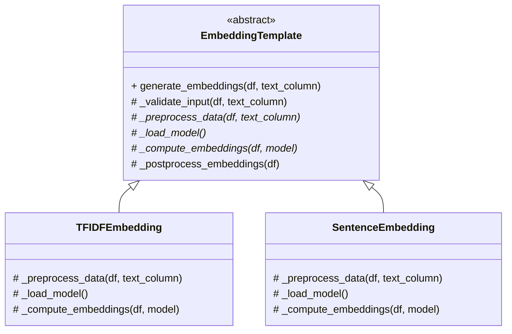

```mermaid
classDiagram
    class EmbeddingTemplate {
        <<abstract>>
        + generate_embeddings(df, text_column)
        # _validate_input(df, text_column)
        # _preprocess_data(df, text_column)*
        # _load_model()*
        # _compute_embeddings(df, model)*
        # _postprocess_embeddings(df)
    }
    
    class TFIDFEmbedding {
        # _preprocess_data(df, text_column)
        # _load_model()
        # _compute_embeddings(df, model)
    }
    
    class SentenceEmbedding {
        # _preprocess_data(df, text_column)
        # _load_model()
        # _compute_embeddings(df, model)
    }
    
    EmbeddingTemplate <|-- TFIDFEmbedding
    EmbeddingTemplate <|-- SentenceEmbedding
```